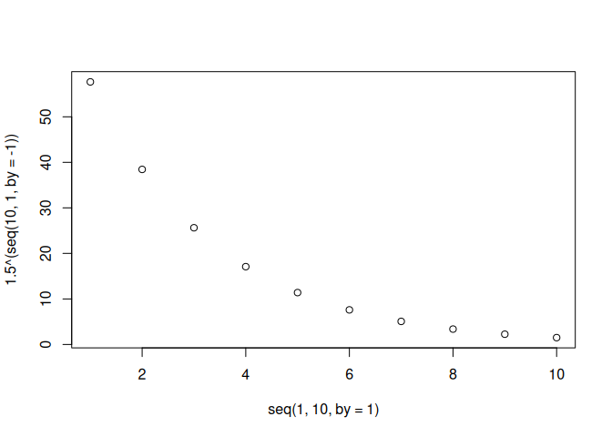

RMarkdown Test with GitHub
================
Ferran Enfedaque
2026-03-15

Fent proves d’RMarkdown pujat a GitHub

``` r
2+2
```

    ## [1] 4

``` r
plot(seq(1,10,by=1), 1.5^(seq(10, 1, by=-1)))
```

<!-- -->
